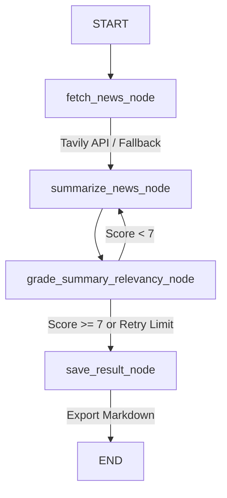

# Autonomous AI News Summarizer and Newsletter Agent

[](https://www.python.org/downloads/)
[](https://github.com/langchain-ai/langgraph)
[](https://streamlit.io/)
[](LICENSE)

An autonomous AI News Synthesis Pipeline built using LangGraph state machines, Tavily Search API, Groq LLMs, and Streamlit. Aggregates multi-source AI news across daily, weekly, and monthly timeframes, evaluates report relevance using Evaluator-Optimizer feedback loops, generates executive summaries, and exports formatted Markdown newsletters.

---

## Key Features

- **Evaluator-Optimizer Workflow:** State machine containing automated relevancy evaluation loops to refine summary quality before publication.
- **Dynamic Timeframe Aggregation:** Configurable news search scope (daily, weekly, monthly, year).
- **Offline Fallback Engine:** Built-in mock data generation ensures resilience when external search services are offline.
- **Automated Markdown Export:** Saves timestamped newsletter digests locally with direct download capability.
- **Streamlit Control Center:** Interactive dashboard to trigger digests and browse historical news reports.

---

## State Machine Architecture



---

## Quick Start

### Installation

1. **Clone the repository:**
   ```bash
   git clone https://github.com/Hamza-HATTAB/ai-news-summarizer.git
   cd ai-news-summarizer
   ```

2. **Set up virtual environment & install dependencies:**
   ```bash
   python3 -m venv .venv
   source .venv/bin/activate
   pip install -e .
   ```

3. **Configure environment variables:**
   ```bash
   cp .env.example .env
   # Add GROQ_API_KEY and TAVILY_API_KEY to .env
   ```

4. **Run Streamlit Dashboard:**
   ```bash
   streamlit run app.py
   ```

---

## Automated Testing

Execute unit and integration tests with pytest:

```bash
pytest tests/
```

---

## Docker Deployment

Build and run using Docker:

```bash
docker build -t ai-news-summarizer .
docker run -p 8501:8501 --env-file .env ai-news-summarizer
```

---

## License

Distributed under the MIT License. See `LICENSE` for more information.
